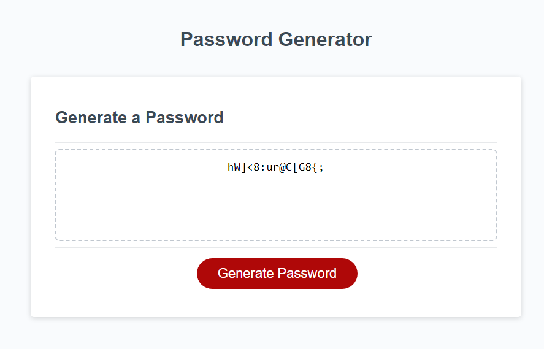

# Javascript Challenge - Strong Password Generator

## **Description**

This was our first project involving Javascript. We were given a starter code of the basic layout and button code but nothing worked. We had to create the function that actually generates the password and then writes that to the text box. This was a very fun project that I went through a few drafts of how to do this best. Some of the original drafts included me hand typing out all of the letters/symbols as separate array objects, then mass combining the arrays and then picking from all those letters. That felt a lot less "random" and kind of janky so I rewrote it a few times before I finally researched enough to figure out how to pull a random letter from a string which made everything work a lot more clean. This was also my first time creating a while loop which seems to work great with simple parameters. I also had quite a bit of struggles with the window prompts/alerts and getting those to pass their value checks to make sure appropriate responses were logged. All in all, I learned a lot here and had to push my knowledge limits to make everything work the way I wanted it to! 

---

## **Acceptance Criteria**
```
GIVEN I need a new, secure password
WHEN I click the button to generate a password
THEN I am presented with a series of prompts for password criteria
WHEN prompted for password criteria
THEN I select which criteria to include in the password
WHEN prompted for the length of the password
THEN I choose a length of at least 8 characters and no more than 128 characters
WHEN asked for character types to include in the password
THEN I confirm whether or not to include lowercase, uppercase, numeric, and/or special characters
WHEN I answer each prompt
THEN my input should be validated and at least one character type should be selected
WHEN all prompts are answered
THEN a password is generated that matches the selected criteria
WHEN the password is generated
THEN the password is either displayed in an alert or written to the page
```
---

## **Preview**


---

## **Usage & Live Link**

To view/use this project, it can be accessed by going to [https://jwatkins28.github.io/Strong-Password-Generator/](https://jwatkins28.github.io/Strong-Password-Generator/). Feel free to generate a strong password for the next account you create! If you'd like to view the code you can use the DevTools in your browser or view the files in the repository. 

---

## **Credits**

- UT Bootcamp
- Nikki and the TA's
- Myself 😁 

---
